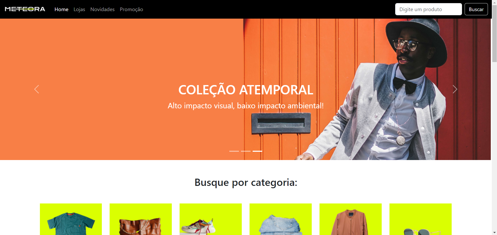

# Meteora

Curso na Alura | Bootstrap5: crie uma landing page responsiva

## Acesso

Você pode olhar o projeto completo publicado [AQUI](https://alucifer7.github.io/Meteora/)

## Tópicos abordados

- Compreenção e utilização da ferramenta Bootstrap na versão 5
- Aplicação de responsividade em imagens e componentes
- Aplicação de temas e cores do Bootstrap em um projeto
- Acessibilidade para leitores de tela
- Posicionamento de elementos utilizando soluções com Grid e Flexbox do Bootstrap


## Tela do Projeto



## Como Usar

1. Clone o repositório:
   ```bash
   git clone https://github.com/alucifer7/Meteora.git
